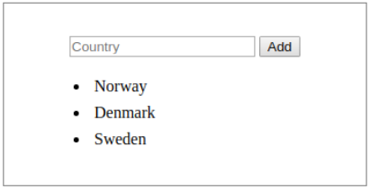

# *Web Development Micro-credential Assignment 02*

#### Overview:

The aim is to apply the fundamentals of Javascript to develop a small interactive application.
In this assignment, you will be coding an interactive and functiona application using HTML, Javascript and CSS(optional). You will be marked on your application functionality and error free functional Javascript code.

---
#### WD02: Javascript
The aim is to apply the fundamentals of JavaScript to develop the logic and interactivity to an HTML page.
- Create a HTML list using an unordered list element, a text-box with the placeholder “item”, and a button that says “Add.”
- Create a function. This function runs when the Add button is clicked and creates a new list element (`<li></li>`) containing the added value and appends it to the unordered list in our HTML document. 
- Make sure that the content of the text box is cleared when the button is clicked so it’s ready for next input from the user
- Code must be organized and explained using comments

---
#### Deliverables 
> - A URL link to Github repository of your completed project code
> - Live URL to your website on Netlify 
> - Compressed (zipped) copy of your Javascript project files/folder uploaded and submitted to Yoobee portal
