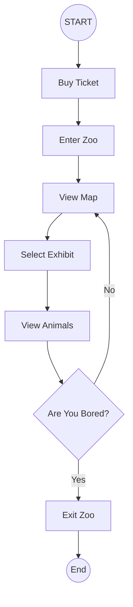

# Super simple UX User Flow Diagram example

```mermaid
graph TD
    Start((START)) --> Buy_Ticket[Buy Ticket]
    Buy_Ticket --> Enter_Zoo[Enter Zoo]
    Enter_Zoo --> View_Map[View Map]
    View_Map --> Select_Exhibit[Select Exhibit]
    Select_Exhibit --> View_Animals[View Animals]
    View_Animals --> Are_You_Bored
    Are_You_Bored{Are You Bored?} -->|Yes| Exit_Zoo
    Are_You_Bored{Are You Bored?} -->|No| View_Map
    Exit_Zoo[Exit Zoo] --> End((End))
```
