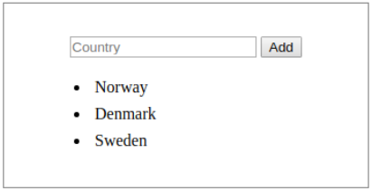

# Web Development Micro-credential Assignment

## Overview

The aim of the first part of this assignment is to apply the fundamentals of HTML and CSS to develop a multiple-page website. In this assignment, you will be coding an interactive and responsive website using HTML, CSS. 

The second part aims to apply the fundamentals of JavaScript to code a small interactive application. In this part, you will be coding an interactive and functional code snippet using HTML, JavaScript. 

You will be marked on your application design, responsiveness, semantic HTML elements, valid CSS, functionality and error-free JavaScript code.

---

### WD01: HTML & CSS
- Minimum of two pages, pages must use proper document structure and organized syntax (formatted, intended, etc.)
- Create a file/folder structure that makes sense to the design.
- You can use any design of your choice to markup into HTML and style using CSS
- Typography, color, content, and image choice are left open-ended and subject to your decisions. Feel free to use placeholder content for images, text, paragraphs, etc.
- Navigation
- Write standards-compliant HTML markup and use semantic elements
- Test all pages in multiple browsers: Edge, Firefox, Safari, and Chrome.
- Website must be responsive and mobile-friendly (CSS Media Queries, relative lengths, etc.)
- Valid properly structured CSS, reusable classes, multiple-lined CSS with spaces and separation of content from style
- Extensive use of CSS grid and flexbox for layout
- Use of pseudo-classes (i.e. `:hover`) and pseudo-elements (i.e.`::before`, `::after`)
- Project code is to be handed in as a GitHub repository (deliverable #1)
- Completed website must be published to Netlify (deliverable #2)
- At least two remote-based components, i.e., inline frames (map, YouTube, etc.) and/or external CSS libraries (i.e., fonts, icons, etc.)
- You should make use of at least 3 meta-tags in the head section (i.e., keyword & description)

---

### WD02: JavaScript
The aim is to apply the fundamentals of JavaScript to develop the logic and interactivity to an HTML page.
- Create an HTML list using an unordered list element, a text-box with the placeholder “item,” and a button that says “Add.”
- Create a function. This function runs when the Add button is clicked and creates a new list element (`<li></li>`) containing the added value and appends it to the unordered list in our HTML document.
- Make sure that the content of the text box is cleared when the button is clicked so it’s ready for the next input from the user
- Code must be organized and explained using comments

---

#### Deliverables 
- A URL link to the GitHub repository of your completed project code
- Live URL to your website on Netlify 
- Compressed (zipped) copy of your JavaScript project files/folder uploaded and submitted to Yoobee portal
